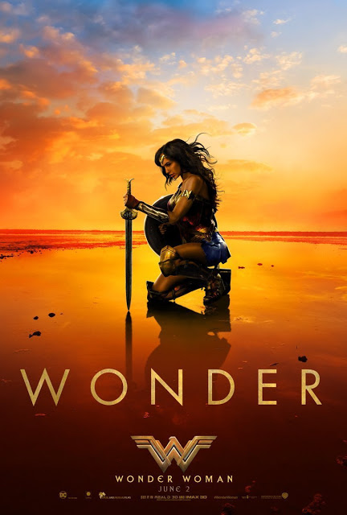

Wonder Woman

Year Released: 2017\
Genre: Action, Fantasy\
Director: Patty Jenkins\
Lead Actors/Actresses: Gal Gadot, Chris Pine

Rotten Tomatoes Score: 93

My Score: 8

Jenkins’ entire approach towards this film was, I believe, the best possible way to direct a film about Wonder Woman. The entire movie is actually a flashback from present-day Diana, which I think is a good way to connect this movie to the rest of the DCEU (much like Captain America: The First Avenger).

The most stand-out aspect of this movie was the acting. From her action sequences, to her rambling dialogue, to her comedic moments, to her emotional commitment, Gadot is on point. The movie is able to expertly weave between banter and action, and the short comedic moments are hilarious. The thing that stands out about this DC movie was its focus on character development and drama as opposed to just over-indulging in pure action and destruction. As Chris Stuckmann says, the ending scene was filled with CGI, but at that point it did not matter as much because a lot of character development had already taken place.

The action sequences, especially the beach scene, tower room scene, and lasso scene were shot beautifully. Although slow-mo could be used less in some instances (such as the double slow-mo during a jump), I actually loved it and thought that it contributed a lot to the gracefulness of Wonder Woman. The colors and visuals are extremely bright, which is a good break from the darkness and desolation of all of the previous DCEU movies. In addition, although this has been used expertly in multiple movies already, _Wonder Woman_ also transitions between multiple fights without any major flaws. In particular, the two fights (WW against Ares, Pine trying to get on the gas plane) really juxtaposes their two goals and roles. Steve is the hero for today, WW is the hero for the world.

Outside of action, we really get to know Wonder Woman and follow her has she matures from her initial naivety that humans are inherently good (although I did think it was unrealistic for her to take that long to realize that she was the godkiller herself, especially given that she had defended herself against her trainer with an X and blew her away); when she learns of the corruption of humans, or when she witnesses an entire town (or Steve) die, we really feel her pain. This is mainly because the movie spent so much time developing her childhood, and a lot of time was spent on her getting to know the world before the actual fighting began.

Another good thing that the movie does is that it develops secondary characters very well. I absolutely enjoyed Sameer’s and Charlie’s presence throughout the movie, and we learn a lot more about their background as the movie progresses. I also really enjoyed Dr. Poison’s character. However, I did think Chief could have been developed further.

WW’s music score, much like many of other DCEU movies, is fantastic. In particular, the guitar solo in the theme is very recognizable, unlike the music scores for many MCU movies. The music is very telling of the movie’s theme at any particular instant, and I thought it was crucial for the movie’s aspect of drama.

Nevertheless, there were a few plot holes. I found her mother to be extremely fickle (she changes her mind about letting Diana train, see the sword, and going to save the world). Although the romance subplot was not needed, it was not overbearing at all. A few other complaints include the expository story (fighting against enslavement?), as well as a sloppy and unexplained ending (everybody hugging when she defeats Ares; WW2?). A small flaw was towards the end, when Ares was taunting WW to kill Dr. Poison, I never believed that Wonder Woman was truly corrupted; in my opinion, she was just distraught over Steve’s death and still mad at Ares. Indeed, I believed the twist at the end was slightly forced; in an effort to make audiences sure that Ludendorff, his dialogue with WW at the gala was very out of place. Sir Patrick seemed to appear out of nowhere, and although this did not lead to any plot holes, we did not truly sense his evil (unlike Dr. Poison or Ludendorff). It is possible that Dr. Poison could have served Ares instead of Sir Patrick.

My second main criticism for the movie is its cheesiness, especially how WW randomly gains so much more power after Steve’s death (although the repeat Steve’s sacrifice showed WW that although man may be corrupt, they are still able to love, which is the ultimate power), as well as Ares’ final words. In addition, the Amazons’ accents, though necessary, were a little off.

All in all, _Wonder Woman_ was a great movie. It was able to surpass all of the previous DCEU movies through its superior character development (rising action structure), comedic moments, and action sequences. Although the ending could have been improved through more explanations, I thoroughly enjoyed the film and would recommend.

Date Reviewed: 06/07/2017
