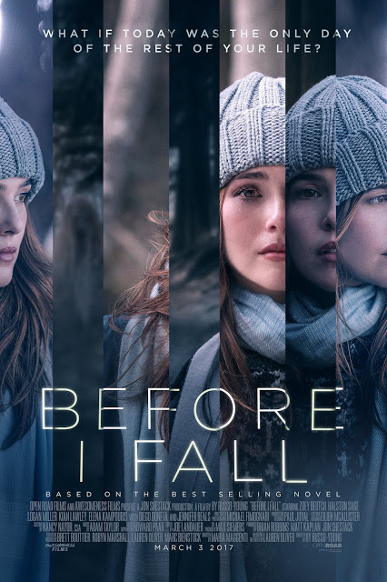

Before I Fall

Year Released: 2017\
Genre: Drama\
Director: Ry Russo-Young\
Lead Actors/Actresses: Zoey Deutch

Rotten Tomatoes Score: 67

My Score: 6

_Before I Fall_ is another Groundhog Day-esque young adult film, and it takes a very simple approach towards describing a pretty simple concept: a young girl realizing who she really is, and how to cherish her life. Overall, the story was portrayed fairly well. However, there were a few pacing issues. In particular, I felt as if the first iteration of the time loop took very long; the main purpose that it served was to establish Sam’s popularity and mean girl status, which could already be inferred within the first 10 minutes. In addition, as the film progresses, different events start to scatter the plot. This became a bigger problem at the end of the movie, during the last iteration of Sam’s life, in which she attempts to help and address everybody, but nonetheless is not able to address everybody adequately (for example, the lesbian girl with the “cool shoes”). This does bring into question why the film didn’t show more of Sam in school (the majority of her day was spent there) so that during the final iteration Sam would therefore also have more time. Although Sam becomes very relatable over the course of the film, a few actions that she commits seem to be extremely out of character (especially her “dark” day) and appear out of nowhere. In addition, there is nothing in the plot that implies that there is a sense of urgency for Sam to break out of the loop (for all she knows, she can party again and again every day without any consequence). Overall, though, I thought the story was simple and organized in the general scheme, and with a few adjustments it would be much better. Although some may be irritated by the unexplained mechanisms/reasons for the time loop, this information didn’t really bother me; for me, the most important part of the film was the underlying message that it was trying to send to all of us. Another very good thing about the storytelling was that that the main character arc was extremely clear. Sam at the beginning of the film is nothing like Sam at the end of the film, and this change is what I like to see; it shows that the protagonist is learning and engaging.

Zoey Deutch was great in this movie; audiences are able to relate to her, and her transformation from the beginning to end is well portrayed. Even when given very cheesy dialogue (the opening and ending quotes, for example), Deutch’s sad yet calm voice still attracts the audience’s attention. Halston Sage as Lindsay also portrayed the character very well; she was almost a mirror image of Regina from Mean Girls.

Unfortunately, the dialogue and music in this movie was quite bland and uninteresting. I personally thought that some of Kent’s words were a little cringe-worthy, and in the end, I really didn’t remember any of the music that was being played.

However, one good aspect that the movie had going for it was the production design and cinematography. I really enjoyed how the film was shot, and it was beautiful. From the use of color to different montages, the film was shot in a way that did not make the repeated cycles get boring over time. In fact, I thought that the first cycle itself was the most boring part of the movie, and after she wakes up again on the second cycle, that is where the movie starts to pick up.

Overall, _Before I Fall_ was a movie with good intentions. It had a very clear, positive message that it attempted to portray through Sam’s transformation, and for the most part, it worked. However, due to its rushed nature, many plot elements were left unaddressed, and this significantly detracted from the film.

Date Reviewed: 06/10/2017
