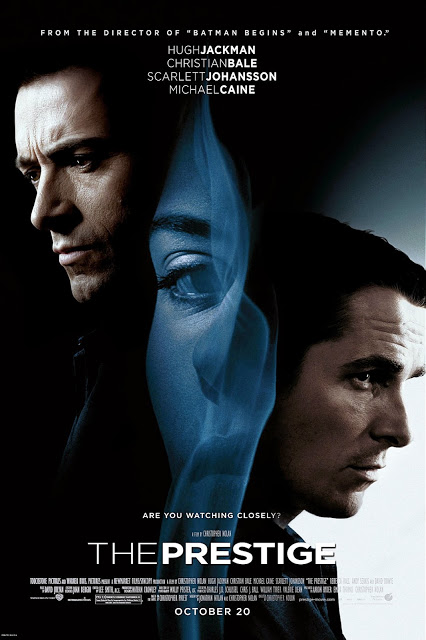

The Prestige

Year Released: 2006\
Genre: Science Fiction, Drama\
Director: Christopher Nolan\
Lead Actors/Actresses: Christian Bale, Hugh Jackman, Michael Caine, Scarlett Johansson

Rotten Tomatoes Score: 76

My Score: 10

_The Prestige_ is one of the most intricate (and yet simple) movies that I have ever watched, and it is so beautifully crafted. It’s storytelling and plot, along with its editing, is expertly put together in a way that not only keeps the audience’s attention throughout the entire movie, but also tricks the viewer so many different times. Throughout the movie, each reveal is excellently timed in a way that shocks the audience, and it is able to do this again and again as the two magicians attempt to outsmart each other, create new magic tricks, or ruin the other’s show. At the ultimate reveal, when you look back at the hints scattered throughout the entire movie (even from the very first shot), you can’t help but think how obvious it should have been the entire time. Indeed, the movie tells you the simple truth from the very beginning, and only until the end do you realize that you had fooled yourself. This is one of very few movies that I recommend watching a second time, as it is only then when you can truly catch the beauty of the film, and how everything fits together.

By far, the general editing and plot structure is perhaps the most standout part of this film. Despite taking place over the course of 15 years, with multiple jumps to different times throughout the period from different characters’ perspectives (the movie dives into layers of perspectives, e.g. diary within a diary), the audience is very easily able to follow everything that is going on, and piece together the sections of time and characters into a fluent story by the end of the movie.

The only small plot hole that I could find was during the trial, when Cutter agreed to reveal the mechanisms behind the Transported Man trick to the judge, even though he himself didn’t know the real mechanism due to Angier restricting him from being backstage. Another very small nitpick was that a lot of luck was needed for each magician to be selected as a volunteer at each other’s show, as well as how Angier stumbles across Nikola Tesla only because Borden was trying to lead him astray, but in reality ironically actually inadvertently helping him. However, both of these two elements are extremely minor, and do not detract from the amazing structure and craft of the film.

Aside from the plot and storytelling (once again, I’m telling you that this is perhaps one of the best plots I have ever seen put in film), the production design, writing, and acting are all stunning. Bale, Caine, and Jackman all put on very convincing performances throughout the movie; we are able to truly feel the roller coaster of emotions each one is experiencing at any given time. The set was very realistic and visually stimulating, and all of the dialogue is never boring, always crucial to how the story unfolds: “Are you watching closely?” The movie implements the often-used method of repeating the opening and closing voiceover lines, but unlike many of movies, when Caine repeats his introduction to the three components of a magic trick at the end of the movie, the audience, having experienced the extremes of magic, is finally able to understand the true magnitude of his words. I found this method to be extremely effective, and this is how it should be used for all films.

In the end, this film is not a story with a protagonist and an antagonist. It's unique because it tells the story of two men as they battle over their obsession, allowing it to consume their lives. The movie is much more of a commentary on human nature and how obsession can lead it to ruin. Throughout the movie, both Borden and Angier believe that magic is a competition, but at very end, Angier reveals the true purpose of magic: to inspire wonder. Both men ultimately lost their sense and direction in pursuit of a competition that should never have happened. This battle is in multiple ways similar to the battle between Thomas Edison and Nikola Tesla; instead of putting their minds together for constructive progress in science, both scientists resorted to sabotaging each other’s work in an effort to show who was better. In this way, Nolan reminds everybody to never lose sight of the true purpose of anything, and to never become consumed by an obsession.

Date Reviewed: 06/12/2017
