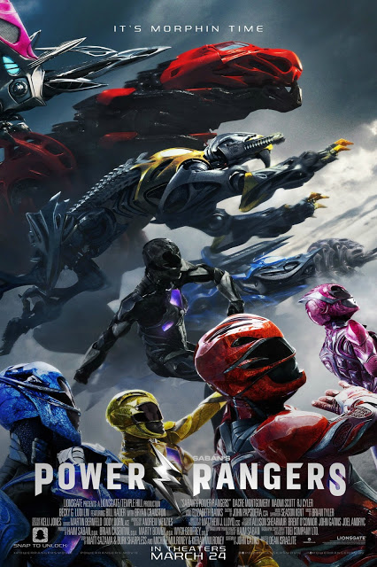

Power Rangers

Year Released: 2017\
Genre: Science Fiction, Action\
Director: Dean Israelite\
Lead Actors/Actresses: Dacre Montgomery, Naomi Scott, Ludi Lin, Becky G, RJ Cyler, Elizabeth Banks

Rotten Tomatoes Score: 46

My Score: 3

Israelite took a very unique taste to his version of Power Rangers; overall, he attempts to make the theme of the film to be much darker and realistic, incorporating the social hardships and family issues that each character faces to really emphasize their “outcast” status, all the while maintaining the series’ original cheesiness. Unfortunately, this combination of grittiness and cheesiness in the same film simply does not work for me.

The entire first half of the movie is dedicated to building up each of the characters, and the backstories are told very seriously, with deep messages hidden within each of them. However, as soon as the Power Rangers become Power Rangers, they lose all of their individualities. Their fight scenes with Rita (a very cheesy villain) lack the seriousness that the first half contained, and it really makes the audience think that the entire fight is a joke. This is particularly apparent when the Power Rangers showed up in their Zords, when the original Go Go Power Rangers theme randomly starts playing, but the music then immediately shifts the sound of serious fighting. This shift is much too sudden, and the grittiness and cheesiness of the fights simply do not match up with each other.

Indeed, the second half of the movie is plagued with plot holes, particularly about the Zords. The way how the Power Rangers are suddenly able to expertly control them without any training, and especially the scene where they “accidentally” become the Mega-Zord reach a point of ridiculousness that I no longer was paying much attention.

Although I do commend Israelite for focusing much more on the darker backstories behind each character so that the audience starts to care about the people behind the mask, it all falls apart at the end due to the ridiculousness of the last scenes.

Overall, in addition to the clearly flawed plot structure, cinematography was lackluster. Although many scene-to-scene transitions and visuals were very creative, for too long the camera was shaking and very close-up, making the film and fights disorienting. When the camera does zoom out so that it fully depicts a Ranger fighting the stone golems, the action sequences and choreography did not impress me that much, either.

One good thing about this film, though, was the acting by the principal cast. However, Dacre Montgomery, despite being the main character, was not the most likable character; instead, RJ Cyler outperformed everybody else. Elizabeth Banks, who played the villain, played the role with too much cheesiness for my liking.

Ultimately, _Power Rangers_, despite having good actors with the right roles, could have been drastically improved in terms of its plot structure, directing style (instead of splitting the film between both seriousness and cheesiness, the film should focus on merely one; in this case, I felt that seriousness was the better option because so much character development had already happened), writing, and cinematography.

Date Reviewed: 06/16/2017
