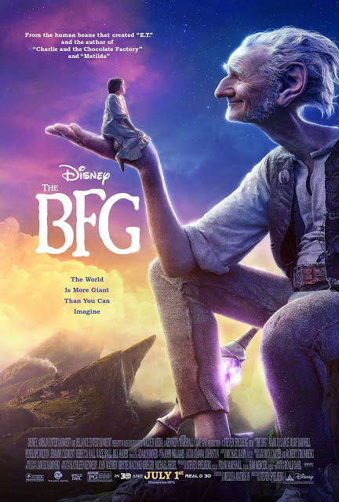

The BFG

Year Released: 2016\
Genre: Fantasy, Adventure\
Director: Steven Spielberg\
Lead Actors/Actresses: Mark Rylance, Ruby Barnhill

Rotten Tomatoes Score: 74

My Score: 6

Steven Spielberg’s adaptation of _The BFG_ by Roald Dahl is something that almost every child will enjoy. In particular, the visuals of the film were fantastic, full of color and motion. All of the CGI involved in creating the BFG and the other giants was constructive to the film, not taking away from the real actor’s emotions. In addition, scenes such as the one involving switching gravity near the dream tree were very creative, and I enjoyed them very much. In terms of visual effects, I really respect Spielberg for taking a giant leap with making a child’s imagination come onto the large screen.

Furthermore, in addition to the fascinating cinematography, another great part of the film is the acting. Rylance and Barnhill had amazing chemistry together, and Barnhill especially was able to convey so much emotion and wonder that every viewer fell for her. The comedic moments were hilarious, the sad moments were heartfelt, and the happy moments were joyful; the audience felt every single emotion that Barnhill conveys. Truly an exceptional performance, and I look forward to seeing her progress in the future.

Now come the major flaws of the film, first starting off with plot structure and pacing. This film was almost 2 hours long, and at multiple moments throughout the film I did get a little bored. This mainly happened during some dialogue scenes, which I thought could have been definitely cut out from the film. In general, I did think that some portions of the film were poorly written, which added to the boredom.

I also had multiple issues with some events that happened in the movie that passes off as very innocent, such as when Sophie decides to get the giant’s attention by jumping off of her windowsill. In addition, the ridiculousness of the plot ending (where the Queen treats Sophie and takes her in) did not really work for me; in the book, Roald Dahl was able to create such as ridiculous ending because there was no true visual representation of it in real life and it was stuck in an artificial imagination. However, in the movie, I personally thought it would have had a much more effective ending if the entire movie was a dream of Sophie’s; that way, it would nicely tie in the quote from before about continue to living on and dreaming, even if a good dream has ended.

Overall, _The BFG_ had excellent cinematography and acting, but it could definitely improve on its writing and pacing. In the end, I would not watch this movie a second time; it kind of loses its wonder aspect after the first. However, I do think that every child should watch this film, as it is truly unique and visually stunning compared to other childrens films.

Date Reviewed: 06/24/2017
