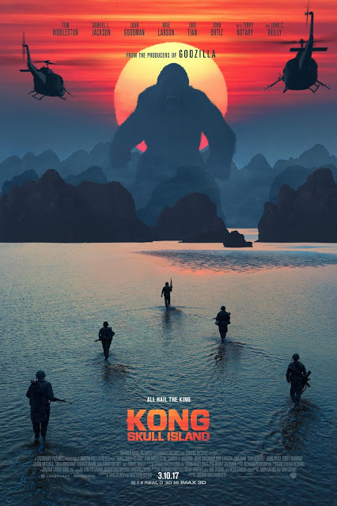

Kong: Skull Island

Year Released: 2017\
Genre: Fantasy, Science Fiction, Action\
Director: Jordan Vogt-Roberts\
Lead Actors/Actresses: Tom Hiddleston, Brie Larson, Samuel L. Jackson

Rotten Tomatoes Score: 76

My Score: 5

_Kong: Skull Island_ brings a new addition to the MonsterVerse franchise, joining _Godzilla_ (2014), and it is entirely what you would expect from a monster movie. The movie is almost exactly like what the trailer implies, with plenty of action and beautiful visuals, but not much in terms of plot and character development. It’s really a movie that you can relax and enjoy, especially when you’re trying to not think about anything too hard, but it’s nothing special compared to others.

Starting off with the good parts, the cinematography was above average. I especially liked how Vogt-Roberts was able to creatively transition between completely different scenes, such as the one between somebody getting eaten and another person eating a sandwich. The film itself is very beautiful, with a very Jurassic Park-esque vibe when they first enter the island (minus the dinosaurs), and amazing visuals containing the different creatures, which I thought were pretty creatives too (giant spider, octopus, cricket). The use of color, especially orange and green gives the film a very unique look, and overall, I thought that the CGI for Kong was pretty good.

In general, the editing and writing were very mediocre; all of the actors were acting pretty convincingly (although I personally didn’t like John C. Reilly’s performance that much), and the dialogue was easy enough to follow, but there were no standout performances in this movie. And this flaw hits harder given this film’s poor character development and plot structure.

By the end of the movie, I really only knew a few of the names of the main characters; some characters, such as San (who I had many issues with), were barely developed at all and had only a few lines of dialogue. Like many of the other characters, she’s given little to no backstory, with the only explanation being that she’s a biologist. For the rest of the movie, San just basically just ran along with the group with a scared expression on her face; she didn’t do anything to change the course of the movie, and only served as a mere pretty face or possibly a character for a future movie (but certainly not this one). In addition to San, characters such as Mason Weaver (Brie Larson) and James Conrad (Tom Hiddleston) were developed slightly more, but not by much. The sad truth is that the most developed character is Packard, played by Samuel L. Jackson, who turns out to be the semi-villain who dies in the end. This is all very problematic because many people die in this film, but none of the audience really care because we don’t really know who he/she truly was.

Outside of character development, the plot of _Kong: Skull Island_ also has many flaws. Throughout the entire story, the characters make some very stupid decisions, some that nobody would ever think of doing. This is especially true with the group deciding to head west, merely to save one single person while killing five in the process to the Skull Crawlers. In addition, the relationship between Kong and Mason is barely developed at all, and it really brings into question why Kong would save her at all (other than the obvious movie necessity for her to stay alive).

All in all, the main feeling I got from this movie was that _Kong: Skull Island_ was pretty much trying to be Jurassic Park; in the end, it performed well visually, but it failed miserably in the department of character development.

Date Reviewed: 06/27/2017
