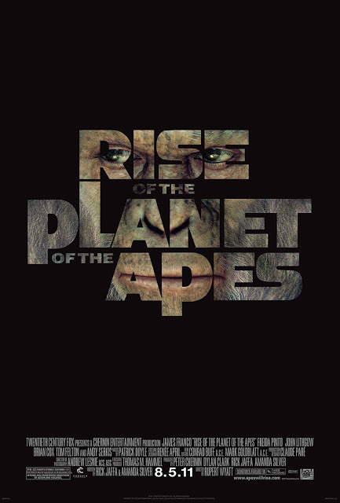

Rise of the Planet of the Apes

Year Released: 2011\
Genre: Drama, Science Fiction, Action\
Director: Rupert Wyatt\
Lead Actors/Actresses: Andy Serkis, James Franco

Rotten Tomatoes Score: 81

My Score: 8

Rise of the Planet of the Apes is the first movie of the new, rebooted Planet of the Apes trilogy, and it honestly seemed to come out of nowhere. Despite having a very simple premise (apes start taking over the world), the Planet of the Apes franchise has always evoked deep thought into human behavior and questioned our perspectives of society. This movie in particular tackles multiple issues, addressing concepts such as freedom as well as questioning the moralities behind genetic engineering and animal drug testing.

First, I want to commend Rise of the Planet of the Apes for telling the story so fluently and gracefully. The entire story is told from the perspective of an ape, Caesar, we as the audience are so easily able to connect with how lonely and constrained Caesar feels throughout the course of the movie. The character of Caesar hits a soft part in our hearts, and we are all rooting for his big escape, starting from his plan to become the new alpha in the primate shelter where he is locked, all the way to his eventual battle with humans on the Golden State Bridge for his species’ freedom. The majority of humans (except Franco, his girlfriend, and his father) are portrayed as evil in this movie, and we have no problem completely flipping our traditional perspectives in order to root for the apes. This effect is accomplished through two ways, both of which the film executes excellently.

First, is amazing acting. James Franco acted very well in this movie, but the real hero is Andy Serkis. Serkis immitates an ape so realistically, and despite not being able to have any dialogue (except maybe Caesar’s first word, “NO”), he is still able to convey Caesar’s wide range of emotions and feelings (from childlike wonder to cruel ruthlessness) through extremely accurate facial and body language. Serkis truly gave one of the most realistic and amazing performance I have seen.

Second, is amazing CGI. The cinematography in this movie makes it stands out above many other films in the way that it is able to so realistically portray different creatures. Through this effective CGI, the audience is able to perceive the apes as if they’re like humans. In particular, the scene that stood out most to me was when the gorilla sacrificed himself in order to save Caesar, and the closeup on the gorilla’s body being shot combined with his determined facial expression really emphasized the sacrifice he was making for what he truly believed in.

These two things, acting and cinematography, is what carried the film for me. Overall, I thought the concept of the overall plot structure was very simple: an ape grows up, he escapes human society, and the movie ends with a large fight. Yet despite its simplicity, the film is able to tell its story so effectively through pure style and technique.

There are a few gripes I have with this film, even though they are extremely small. The first plot hole I had a little trouble comprehending was Caesar’s random ability to pick locks out of his cell. In addition, once he escaped, there was no security in the shelter at all, so Caesar could even go home to steal the canisters of ALZ-113, which seemed a little bit too unrealistic. Also, how did Caesar even know that ALZ-113 was in Franco’s possession, let alone existed? After all, he had only been treated, and seen, ALZ-112 before he was locked up. And how is Franco so easily able to smuggle out drugs?

Second, the pacing of this film seems a little slow at first, but picks up so quickly at the end that it certainly surprised me. The reason for this is because of the film exaggerating the sheer number of apes as they start to gather together. At first, we only see around 20 apes in the shelter, but by the time the apes escape, there seem to be dozens of them. By the time the apes arrive on the bridge, there are already hundreds of apes. Are there really hundreds of apes in San Francisco alone?

My third and final problem with this film is how it chooses certain apes to be “smart” in order to progress the film. In particular, in order to make the plot work out, Maurice (the orangutan), Rocket, and the gorilla all seemed to be already pretty smart when Caesar meets them, despite not receiving ALZ-113, whereas all of the other apes were much dumber.

Overall, despite having a very simple plot, Rise of the Planet of the Apes is nonetheless an amazing movie, supported by its incredible actors and stunning cinematography. This film is not for everybody (some people just aren’t able to appreciate the emotions of the characters and just take the plot at face-value, which greatly diminishes its effect), but I still recommend this movie to many.

Date Reviewed: 07/13/2017