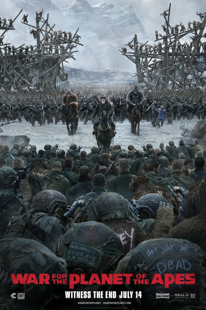

War for the Planet of the Apes

Year Released: 2017\
Genre: Drama, Science Fiction, Action\
Director: Matt Reeves\
Lead Actors/Actresses: Andy Serkis, Woody Harrelson

Rotten Tomatoes Score: 95

My Score: 7/8

If you go into watching _War for the Planet of the Apes_ expecting the same action, fighting, and “war” that you saw in _Rise_ and _Dawn_, I’m sorry to say that you will be disappointed; _War_ is completely unlike any of its predecessors in the Planet of the Apes trilogy. Despite being titled “War for the Planet of the Apes.” this movie is much less of an action war movie, and more of a drama film telling the final chapter of Caesar’s life. Whereas Caesar was young, energetic, and powerful in the previous films, he has gotten much older and wearier from battle, so the film instead focuses much more on his emotions and feelings as he nears the end of his life. Although the replacement of the action-drama mixture of the previous two films with pure drama certainly does not make War for the Planet of the Apes any worse, it will disappoint any viewers expecting the same action sequences as before.

This film is the longest in the trilogy, with a runtime of 2 hours and 22 minutes, and the pure drama and suspense that is felt by the audience throughout the majority of the movie does make it seem much longer as well. Whereas each of the previous movies had very clear climax points in the plot indicated by the final fights between the apes and humans, War for the Planet of the Apes has no clear climax. It seems as if almost the entire movie is rising action, kept in suspense, as Caesar attempts to hunt down the Colonel and escape with his ape family. Because of this, the audience is constantly kept at the edge of their seats, pulling on their heartstrings until Caesar’s eventual death in the final scene. I have to say, ending the movie this way was extremely satisfactory for me as the viewer, because it shows that the trilogy describes the life of Caesar and provides a deeper perspective of his individual humanity, not necessarily the entire ape species.

Like its predecessors, War for the Planet of the Apes provides a deeper reflection into human behavior and humanity. The main moral dilemma that his particular film tackles is how to maintain your own species’ survival during such desperate times. This is exactly what all the humans must consider when making their move, and I love how the film was able to use this problem to frame and create such as a complex character in the Colonel. I love those villains that are so complex that to some level you understand and may even agree with his actions, and the movie executes this expertly. Overall, along with Caesar, the Colonel is one of my favorite characters in the entire trilogy. In particular, his final action to commit suicide in order to stop the spread the disease mutation, is so important and crucial because it not only affirms his own belief, but also saves Caesar from becoming the hate-driven ape represented by Koba.

Even though the plot was able to keep its audience on their edge for almost the entirety of the movie with its character complexities and extensive focus on Caesar’s emotions, culminating in a satisfactory ending, I still saw some pacing and editing issues throughout the film. This is mostly due to the fact that the film tried to accomplish and address too much in a limited amount of time, leading to some awkward sequences of events. For example, the first half of the film is almost completely silent, highlighting the suspense as Caesar discovers a new abandoned place with a gun in his hands. However, this happens multiple times throughout the beginning, and it certainly does get quite boring and tiring after a while. In addition, multiple elements from the film could have been cut completely, such as Luca. Even if the filmmakers still wanted to keep Luca in the film, they should have at least re-ordered some of the scenes so that the flower scene and Luca’s death wouldn’t be right after each other, making his death very predictable and cheesy (which it should not be).

Because of all of the extra time spent on the slow, suspenseful start, the ending of the film seems extremely abrupt and sudden. It felt as if the filmmakers had run out of time, so they purposefully made the guards of the military camp extremely dumb (so that literally all of the apes could escape without them noticing) and make a snow avalanche appear out of nowhere (killing a huge army of humans without any consequence to the apes) in order to move the plot along and bring it to a close so that the film wouldn’t be ridiculously long. I also would have liked the film to flesh out the donkeys (apes who rebelled against Caesar and joined the humans), especially the one who randomly changed his mind at the end and sacrificed himself to save Caesar (although the film does try to justify this right before by the slow-mo shots of apes dieing, it again feels rushed and doesn’t completely work because earlier in the movie, the same donkey was literally hurting and killing apes himself).

These were the only flaws that I saw in this film, and overall I thought the film was still a masterpiece. I really liked that the movie had the balls to kill off Caesar’s family in order to really show the deep emotional drama and humanity behind Caesar as he struggles with the grief and hate. The acting, like before, was performed so well, this time not only by Serkis, but also Harrelson as well. Furthermore, CGI and all of the production design has clearly improved even more than before; Caesar and all of the apes truly look life-like. In addition to the deep, complex characters, I did enjoy the presence of something new in the trilogy: a comedic relief (although I understand that some do not enjoy his presence and think that his comedy undermines the seriousness of the film). And finally, I thought the use of sound was executed well, with the use of silence to create additional suspense and music to draw out certain emotions. And once again, I want to re-emphasize that I truly loved the final scene in this film.

Even though it does have its negatives, _War for the Planet of the Apes_ is a solid ending to a solid trilogy, and I am nonetheless very happy for the trilogy’s success. Despite some pacing and editing issues, the film as a whole is beautifully directed and acted, with its expertly constructed production design and amazing cinematography.

Date Reviewed: 07/16/2017
