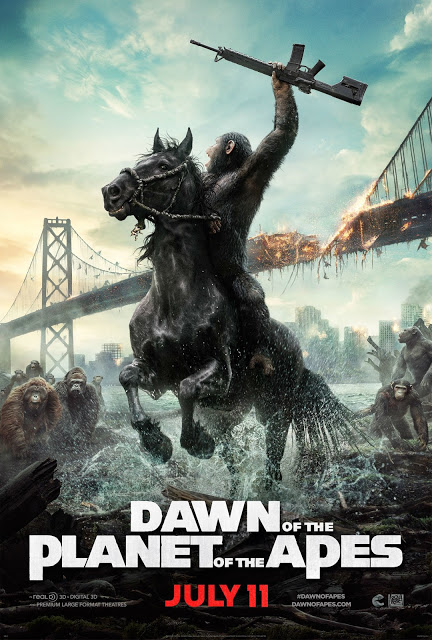

Dawn of the Planet of the Apes

Year Released: 2014
Genre: Drama, Science Fiction, Action
Director: Matt Reeves
Lead Actors/Actresses: Andy Serkis, Jason Clarke

Rotten Tomatoes Score: 90

My Score: 9

_Dawn of the Planet of the Apes_ is by far my favorite film in this new trilogy, and for good reason: unlike _War_ (the third film), it brings the perfect mixture of action and drama, and it offers an entire new layer of complexity compared to Rise (the first film). Whereas the first film was merely focused on the struggle between apes and humans, with humans portrayed as the immoral, evil side and the audience really rooting for Caesar and his apes, _Dawn_ clarifies this previous message to clearly show how the apes are truly mirrors of humans themselves by pitting ape against ape. And just how Koba represents the hatred and evil in apes, Malcolm (played by Clarke) represents the empathy and morality in the humans. In the end, this movie brings Caesar into a whole new level of maturity and understanding as he finally understands that apes are, in reality, the same as humans.

Overall, the plot is structured so well that it’s hard not to pay attention throughout the entire movie. One aspect of the film that makes it so interesting is how it describes the constant interactions between three main parties: Caesar and his family, Koba and his followers, and the humans led by Dreyfus and Malcolm. The extended conflict between these three groups keeps the movie on a suspenseful note, even during peaceful times, which I loved. For example, while Caesar and the humans were bonding while fixing the dam, Koba deviates and learns that the humans are testing weapons, thus leading to a huge disagreement. Meanwhile, Carver’s character serves as another rift between Caesar and the humans, as his immorality and hatred poses as a threat to all apes. The movie expertly weaves between the perspectives of all three parties, keeping the audience aware, informed, and most importantly, tense as they learn of more and more conflicts emerging. Because of this, _Dawn of the Planet of the Apes_ is paced excellently.

This movie also masters the method of setting up one important element before impacting it to maximum effect. For example, the beginning of the movie sets up the close camaraderie and friendship between Caesar and Koba through Koba saving Caesar from the bear attack, thus making the eventual betrayal of Koba to Caesar even more heart wrenchingly painful to watch. Through these two pivotal points, the audience is able to clearly see Koba’s gradual transition throughout the film, from a symbol of teamwork to a representation of evil and selfishness as hatred pulls him into the darkness. His disregard of apes by the end of the film is what puts him into a zone of immorality beyond forgiveness and recovery. Another smaller example of this set up - pay off effect is implemented when the camera briefly fixates on a young, inexperienced soldier before the attack of the apes. We as the audience can visibly see the fear in the soldier’s face, which makes his death later in the battle much more emotional (even though we don’t even know the soldier’s name or background).

In addition to the excellent overall structure and message, this movie is very well written. The dialogue is seldom boring, with only a little exposition towards the very beginning being a little uninteresting. I believe that part of the reason for this is that for apes in particular, their method of communication focuses on the visual component (sign language) than the aural component, forcing the audience to pay special attention to their conversations. Indeed, the first time I watched this film, there were no subtitles, and although I was initially pretty confused, I was still fully immersed and able to comprehend the movie based on the apes’ body language.

This brings me to a few more big positive points of this film, which is the acting, production design, and cinematography. Just like all of the other Planet of the Ape films in this trilogy, Serkis really gives an amazing performance as Caesar. Throughout the film, Serkis’ facial expressions really are able to convey the deep emotions as he faces new challenges. This is in part due to the hyper-realistic CGI that once again makes this film stand out. And even if that’s not enough, the camera work makes this film even more enjoyable to watch. In particular, the 360 degree shot of Koba breaking through the human base is one of my favorite shots in the entire movie, because it concurrently reveals the surrounding battle while showing the apes entering the base from a completely new perspective.

There were a few minor plot holes that made this movie a 9 instead of a 10. Most of them have to do with the humans...

First, as mentioned previously, the beginning exposition for the humans was slightly boring (even though I do recognize that it was needed for setting up the lack-of-power conflict and the humans’ desperation, it could have been shortened. I especially thought that the scene/conversation between Malcolm and his girlfriend was a little cheesy, and the dialogue could have been improved.

In addition, this movie ends with the outcomes of the humans a little unclear. Even though the humans escape, where do they go? In addition, Dreyfus’ actions towards the end of the film were slightly questionable. What’s the point of blowing up the tower, killing 5 humans in the process, just to kill some of the apes? Weren’t the military already coming to fight the apes?

Furthermore, even though this film develops the main characters (Malcolm, Dreyfus, Caesar, Koba) extremely well, the audience knows almost nothing about the side characters (namely the people other than Carver and Malcolm who worked on the dam), making it slightly awkward and uncomfortable when we don’t feel anything when they die from apes chasing them.

Finally (and this was slightly disturbing for me), in their plan to escape from the Koba’s prison, don’t Maurice and Caesar’s other followers kill apes by crushing them underneath the bus in order to escape? If so, this would directly constradict Caesar’s morals, and instead align with Koba’s.

All of these are very miniscule issues that can easily be disregarded completely. With a flawless combination of pure action, emotional depth, strong character development, superb acting, interesting writing, and stellar cinematography, when the film is taken as a whole, _Dawn of the Planet of the Apes_ is a masterpiece.

Date Reviewed: 07/19/2017
