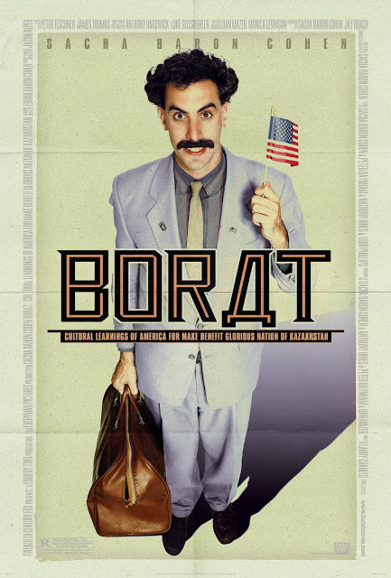

Borat: Cultural Learnings of America for Make Benefit Glorious Nation of Kazakhstan

Year Released: 2006\
Genre: Comedy\
Director: Larry Charles\
Lead Actors/Actresses: Sacha Baron Cohen, Ken Davitian

Rotten Tomatoes Score: 91

My Score: 7

Borat is perhaps one of the most well known comedic characters, and for good reason. With Borat, Sacha Baron Cohen takes a completely different and unique approach towards comedy. Filmed in a mockumentary style, the movie follows an offensive, clueless Kazakh journalist Borat (portrayed by Sacha Baron Cohen) as he travels across the US, encountering different people and learning from their culture (while imparting some of his own). The thing that makes this film stand out so much is that there are only roughly 4 cast members: Borat, his assistant, Pamela Anderson, and a hooker named Luenell; all of the other characters in the film are actual Americans unaware that they are being filmed for a comedy movie. With this in mind, watching Borat becomes an even funnier experience, especially when sometimes, the reactions are too good to be true (especially the horse falling while Borat was singing the national anthem).

In general, content-wise, Borat is hilarious. Even though we all know that we would hate to meet a person like Borat in real life, while watching the movie, everybody nonetheless falls for the character and his unhesitant offensiveness towards so many different groups. Every encounter with a new group of people brings fresh new laughs, and the film really showcases how different America is, based on where you visit. In addition, in an age where the majority of comedy is based on dialogue, a lot of Borat’s comedy comes from small visuals scattered across the film (such as the cow in Borat’s home, or the bear’s head in the fridge). And ultimately, I really have to commend Sacha Baron Cohen for sticking to his goal and actually having the balls to pull off some of the pranks that he did, all in order to make a comedy film.

In some scenes, the film falls flat simply because it takes things a little too far and long, where watching it became more awkward than funny. The biggest example of this is the naked hotel fight between Borat and his assistant, which eventually leads to them running through a conference without any clothes on. Personally, I thought this scene dragged on for way too long, and in the end, it really didn’t accomplish anything other than show that two men had the courage to actually fight each other naked in a public conference room. The same thing happens during the dinner scene when Borat is in the south (although not as much as the naked fight). In general, I think Borat thrives in its short bursts of comedy which often shock the audience and generate laughs, whereas it starts to drag in the longer interactions where Borat becomes more annoying than funny.

It is important to note that this film is definitely not enjoyable for some who may think it is just filled with crude and dirty humor. But overall, Borat nonetheless takes a completely new approach towards a generally static movie genre, and it will always remain as one of the most iconic comedy films.

Date Reviewed: 08/06/2017