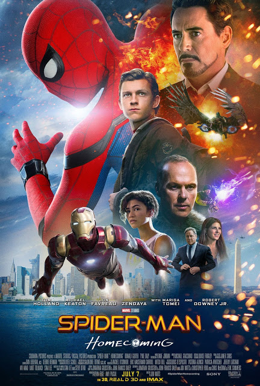

Spider-Man: Homecoming

Year Released: 2017\
Genre: Fantasy, Science Fiction, Action\
Director: Jon Watts\
Lead Actors/Actresses: Tom Holland, Michael Keaton

Rotten Tomatoes Score: 92

My Score: 7

Although being a remake, the newest addition to the Marvel Cinematic Universe, Spiderman, is quite unlike any of its previous versions. Because of this, the movie brings a whole new flavor and look to one of our favorite superheroes, making it a very enjoyable and exciting experience.

First off, I really liked how Watts approached making this film. With _Spider-Man: Homecoming_ being the third iteration of the character, one of the main concerns I had going in was that it would be too boring and repetitive. We had already seen this with The Amazing Spiderman movies (which in my opinion, were a gigantic failure), which completely repeated the events from the original Spiderman movie, all in order to set up the origin story. Even though some plot points were changed slightly, almost everybody already knew what would happen, making the first half of The Amazing Spiderman extremely dull and boring. However, with _Spider-Man: Homecoming_, Peter Parker is given no origin story (with the filmmakers correctly assuming that the audience already knows Spiderman’s origins), so the film is able to jump into the action immediately, making it interesting from the very start. And for the audience members that don’t really know Spiderman’s origins, the film still leaves little clues about what had happened before the events of the film took place through Ned’s constant stream of questions when he finds out his friend is one of the Avengers (What powers do you have? What happened with the spider?). Instead, the film is able to focus a lot more on the high-school aspect of the character, something that is completely new and has not been explored before by other films. By adding more scenes with Peter Parker being a student rather than a masked superhero, the filmmakers make it much easier for the audience members, especially teenagers, to connect with Spiderman than before.

The casting choices made in this movie were also very good, particularly Tom Holland as Spiderman, and Michael Keaton as the Vulture. In terms of playing the villain, Keaton acts perfectly, being both an intimidating yet intriguing character to capture the audience’s attention. But the true star is Holland as Spiderman. Whereas previous versions of Spiderman had the superhero looking much older, Holland truly looks like a high-schooler, and he brings a much higher level of energy, humor, curiosity, and overall passion to the role than McGuire and Garfield. In addition, Holland is able to portray a wide variety of emotions throughout the entire film extremely believably. When he’s joyful, we too are all happy, and when he’s crying and calling for help, it is painful to watch him struggle.

Overall, I had very little issue with the overall plot structure and writing in the film. The film was hilarious in many places (one of the best and most creative starts to a movie I have ever seen) and through many characters (I loved Ned as Peter Parker’s sidekick, and his dialogue was amazingly funny), but it is still able to get very serious very quickly. In addition, Spiderman himself was developed extensively; throughout the film, we can really see his enthusiasm to help, his excitement to be a part of something new, and kindness to help others through every single action he takes. In addition, the Vulture is also a very complex, developed character, which I loved. The film starts off with his backstory, which sets him up as a much more relatable, emotional villain that the audience is able to connect with (he’s just a man trying to provide for his family), making the battle between him and Spiderman much more meaningful. The plot twist in the middle of the film that reveals the Vulture to be Peter’s crush’s father also worked; it added more depth the character, connecting him to Peter on a much more personal level.

Now come the issues I have with this movie, which all pretty much stem from smaller, individual events that take place throughout the film. First, I did think that the ending was a bit unsatisfactory. There was no conclusion between the romance between Liz and Peter, and it seemed a little weird from the very beginning why Liz liked Peter in the first place, especially with his previous actions (such as ditching the national competition). In general, problems such as this resulted from a lack of character development for the majority of the secondary characters, such as Liz. This lack of character arc creates even more problems as well. For example, Zendaya as MJ was more as a comedic relief and Easter egg, but not very interesting at all. Shocker was also an Easter egg that was hardly developed at all. He just appeared and disappeared between scenes to give Peter a little challenge every now and then, and his fate didn’t really matter at all by the end. Another problem I had with the ending was the reactions that Tony and Happy had. In my opinion, they were a little too overexcited over Spiderman after they had heard what happened. Even though Peter did catch the Vulture and prevent him from stealing away Stark’s equipment, in the end, all of the equipment was still destroyed. What is the point of saving something if it ends up destroyed anyway?

This brings me to another point, which is that the stakes aren’t that high. This is exactly the same issue that I had with Ant-Man. This film is very self-contained, and in order to keep it that way, the body count is extremely low. Really, the only death that we witness on screen was the Vulture accidentally killing Shocker (which I think in and of itself poses many problems, as it attempts to establish the Vulture as a menacing villain but fails miserably because it half-asses the death as an accident). Although this makes sense for a kid like Spiderman, it still made me not too invested in Spiderman’s goal. In fact, I feel that Spiderman himself had caused a lot of the destruction in the first place. For example, he was the one that (indirectly) brought the alien element into the Washington Monument, destroying it and risking his classmates’ lives. His lack of caution and seriousness was the reason why the shop at the beginning exploded from the alien gun. Same thing with the ferry as well. In my opinion, if Spiderman had been more careful, he could have definitely prevented at least half the accidents that took place in this film very easily.

Speaking of the ferry, I thought that the entire ferry scene was very disappointing. This is clearly an attempt to copy the train scene from Spiderman 2, which is widely regarded as the best Spiderman film to date. However, we don’t feel as much panic as we did during the train scene, and this is due to two main reasons. First, in the train scene, Spiderman was the only one to stop the train, so we really feel his struggle throughout the entire process. However, in _Spider-Man: Homecoming_, Spiderman isn’t even close to preventing the ferry from splitting, and in the end, it was Iron Man who saves everybody, not Spiderman. The second reason has to do with cinematography.

Overall, the actions scenes, including the ferry scene, are shot with many cuts and a lot of movement. This makes the movie quite disorienting to watch, particularly during the final plane fight scene. Meanwhile, scenes from Spiderman 2 incorporate much longer, wider shots, which I thought were more effective in capturing the vast movement that Spiderman makes.

My final issues with the movie were that its overall score wasn’t too impressive (like many Marvel movies), and also that it was particularly cheesy during the scene where Spiderman is stuck underneath a tractor and can’t get out, then looks at a reflection of himself, then somehow musters enough strength to break free. However, this is just a minor issue in this overall great movie.

_Spider-Man: Homecoming_ is no doubt one of the better Spiderman movies in a very long time. Although it may not topple Spiderman 2 as the greatest Spiderman movie of all time, it brings a fresh new take to the superhero, and I thoroughly enjoyed the film.

Date Reviewed: 08/13/2017
