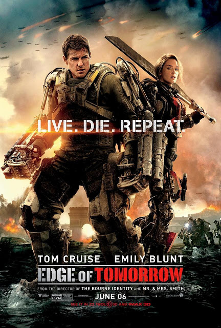
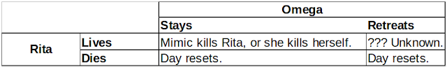
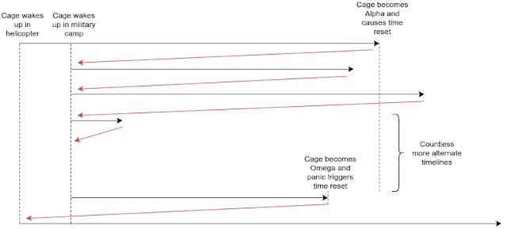

I recently re-watched one of my favorite movies, _Edge of Tomorrow_ (2014), and it got me thinking once again about the complex plot and how everything worked out in the end. If you read multiple reviews made by professional movie critics, you'll find that many thought that the overall film was solid, but had issue with how the movie ended. In particular, most critics believed that in an effort make the movie finish on a high note, director Doug Liman completed ruined what had been a structurally sound (in regards to time travel) plot up until that point. While I do agree that the ending did ruin part of the suspense of the last action scenes, I wasn't too irritated by it because it stayed in line with the movie's overall comedic tone. Indeed, this was part of the reason why [Liman and screenwriter Christopher McQuarrie chose to end the movie on a much happier note](https://filmschoolrejects.com/edge-of-tomorrow-alternate-ending/), instead of the original darker, more somber ending that All You Need is Kill had originally ended with. Instead, I wanted to take a closer look at how time travel in _Edge of Tomorrow_ works, and if its mechanisms were truly broken in the final ending scene. In the end, I was able to come up with a reasonable explanation of the last few events, all without breaking the rules of time travel that the movie had established before. So here's my plot analysis of _Edge of Tomorrow_, and my attempt at explaining what happens at the end of the movie.

Note: Before I begin, I just want to put it out there that obviously, I'm going to be making a lot of assumptions; some of them may be true, some may be false. However, all the assumptions I make are not contradicted by the movie itself, so I will assume that all of them are at least valid possibilities.

### Part 1: The Battle at Verdun

I want to first tackle the first point of confusion that some of the audience may have had, which is the Battle of Verdun. Specifically, why did the aliens purposefully lose the war? Of course, the obvious answer, as stated by Rita Vrataski (played by Emily Blunt), is that the aliens want to make the humans over-confident in themselves so that in the next battle, humanity would throw in everything it has, thus ensuring a speedy victory and conquest for the aliens. However, the fact that it took hundreds of iterations (we know this because Rita herself has lived the Battle of Verdun countless times) makes it extremely odd that it takes this long for the aliens to purposefully lose. If they wanted, they literally could have sent out a few hundred mimics (no alphas) on the first try, let them die, and then call it a day and retreat, thus letting the humans have their win.

In my opinion, the fact that it takes the aliens so many times to finally lose implies that they had another goal in mind. I therefore propose the following explanation:

Rita was partially wrong; the aliens did not lose purposefully only to trick the humans into thinking that they would win the war. The main reason why the aliens chose to purposefully lose was to exit the stalemate that is caused by Rita having the power to reset the day when she dies. Originally, on the first try, I'd say that the aliens had no intention of purposefully losing; they wanted to beat the humans swiftly at Verdun and conquer the world immediately. This is probably why they sent out the Alphas along with the Mimics, so that the Alphas have more control over the Mimics and maneuver them better throughout the battle. (I'm assuming that each Alpha has an army of Mimics that it basically controls, or tells what to do.) However, by allowing the Alphas into the battlefield, the Omega unintentially allows Rita to kill an Alpha and accidentally absorb its blood, thus gaining the day-reset power.

From this point on, Rita now has the same power as an Alpha, and the aliens and humans are eternally stuck in a stalemate. If the aliens win, Rita dies and the day resets to the beginning of the battle. If the humans win, one of the Alphas definitely dies, thus resetting the day as well. Over time, the Omega realizes that one of its Alphas is a human, and it realizes that the only way it can truly conquer the world is if it hurts Rita but lets her live, and then immediately retreat (thus losing the battle).

I've set up the following table that takes a game theory approach to explain why the only way to exit the stalemate is for the aliens purposefully lose the battle.

As you can see here, no matter what the Omega chooses to do (either stay in battle and win, or retreat and lose), if Rita dies, the day resets. If the Omega stays and wins the battle, there is no chance of Rita living. Either the Mimics kill Rita, or she eventually kills herself to once again reset the day. Of course, there's the chance that the Omega tried to trick Rita the same way it attempted to trick William Cage (played by Tom Cruise) by trapping her but keeping her alive for a few days while still continuing battle, but we know that Rita must have either escaped or managed to kill herself, thus making the plan fail. In addition, the trick only works a single time (once it is implemented, Rita knows that the Omega is trying to trap her and won't go to the same location anymore), so after that single failure attempt, staying and battling is no longer an option for the Omega, because no matter what, Rita will die and the day will reset. Thus, the only option left is to retreat and let her live. More specifically, the Omega's plan is to hurt Rita in a way that prohibits her from killing herself, then immediately retreat so that the humans can treat Rita, conduct a blood transfusion, and make her lose her power. This explains why it takes the aliens so many attempts to purposefully lose: they only want to retreat when they have successfully hurt Rita in a very specific way. Thus, the real reason why the Omega ultimately chooses to retreat and lose purposefully is because it is simply too hard to keep Rita alive if the aliens stay and battle.

### Part 2: The Last Scene

Now it's time to tackle the main issue of this post: what happened in the last scene? Why did Cage survive? Why did the Omega die? Why did Cage wake up in the helicopter? I will attempt to answer all of these questions.

First, let's clear up the easiest question, which is why Cage wakes up in the helicopter instead of on top of the the military bags where he normally wakes up. The key to the answer is to remember that Cage waking up in the helicopter and Cage waking up in the military camp both occur on the same day.

The best way to explain the full answer is to express each time that Cage wakes up (or regains consciousness) as a separate save point. When Cage kills the Alpha for the first time, time resets to the save points closest to 24 hours before the Alpha was killed during the battle, which is when Cage wakes up in the military camp. That point in time serves as the save point for Cage for the majority of the movie. In fact, every single time that Cage dies (excluding his final death), the save point remains the same because he hasn't changed the save point by killing another Alpha/Omega.

However, for his final death in the last scene, Cage kills the Omega and absorbs its blood, thus creating a new save point. Because this is all occurring the night before the actual battle, the newly established save point occurs earlier than the time when Cage wakes up in the military camp. Specifically, the closest time when Cage regains consciousness 24 hours before the night of the Omega's death is when he wakes up in the helicopter. Thus, this is the real reason why in the final scene, time resets to an earlier point when Cage wakes up in the helicopter instead of in the military camp.

Now that we have that out of the way, let's get to the hardest part, which is explaining the mechanism behind the final time reset. Before I begin, let me list out a few assumptions I have made to make this explanation make sense:

- The Omega consists of 2 parts: the brain and the body. The body is responsible for resetting time, while the brain is responsible for retaining/storing memories.
- When an Alpha is dying, the Omega receives the signal to reset time. To do this, the Omega stores the dying Alpha's memories in its brain, along with its own memories. Then the Omega's body activates the time reset, creating an alternate timeline starting with the Alpha's save point. The Omega then sends its physical brain into the alternate timeline, and sends its stored memories into the previously dying Alpha (now alive and well). The Alpha now has its memories from its life in alternate timelines, and can adapt accordingly. This explains why when Cage dies, he only retains his own memories, and not any other Alphas'. This also explains why none of the Alphas know Cage's memories, so their attacks remain the same across each alternate timeline. Cage can then memorize the sequence of events, as observed in the movie.
- Whenever an Omega is physically hurt at all, it automatically resets time as a panic reflex. Same mechanism as before, but this time, it only stores its own memories as it sends its brain to an alternate timeline.
- We know that the Omega's physical brain gets sent to an alternate timeline because memory is physical. Specifically, memories are represented by the number of neuroreceptors physically installed at the synapses between each neuron.
- When the Omega explodes, its exposed blood still retains its power to create alternate timelines and send back its brain for at least a few seconds. This is because blood cells are able to still live for a while when outside of the body. In the movie, the blood's power is most likely represented by its bright blue glow. Over time, the blood loses its power as it loses its glow.
- Similar to how Cage becomes an Alpha when he absorbs an Alpha's blood, Cage becomes an Omega when he absorbs an Omega's blood. Thus, we know that Cage absorbs the blood when it still contains its power because it is still glowing when it touches Cage. Thus, Cage becomes a second Omega.

Okay, that should be it. Now we can go over the sequence of events:

1. An Alpha punctures Cage's back. His body is now physically hurt, in the process of dying. However, his brain is completely fine.
2. Cage drops the grenade into the Omega.
3. The grenade explodes, hurting the Omega's brain and body. The Omega's brain is now damaged.
4. Because the Omega is now hurt, it panic triggers the time reset, sending its (damaged) brain back in time in an alternate timeline. The Omega's body remains in the present timeline.
5. Because the Omega's body is still in the present timeline, and its blood has not yet lost its power, Cage sinks into the blood and absorbs it, thus becoming an Omega.
6. Now an Omega, Cage senses his own injuries and also panic triggers the time reset, sending his (still intact) brain back into the same alternate timeline that the true Omega had just created.
7. Both Cage and the true Omega are in the new alternate timeline, starting with both of their own respective save points. For the true Omega, its save point is probably exactly 24 hours before, while for Cage, his save point is when he regains consciousness in the helicopter. The Omega has a damaged brain, while Cage does not. Due to its damaged brain, the Omega cannot command any of its Alphas anymore, and it eventually dies, bringing down the entire network of Alphas and Mimics.

So that's it! It's really confusing, so I've included a diagram below. In the end, I think that everything still works out.

Thank you for reading!
