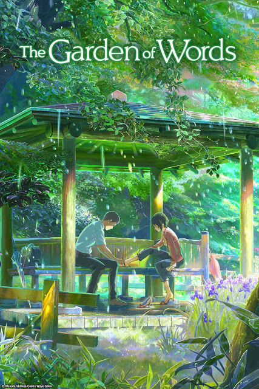

The Garden of Words

Year Released: 2013\
Genre: Drama, Romance\
Director: Makoto Shinkai\
Lead Actors/Actresses: Miyu Irino, Kana Hanazawa

Rotten Tomatoes Score: N/A

My Score: 6

Just as a disclaimer, I have only watched this movie only one time (and as of now I plan to keep it that way) so in no way is this post comprehensive; I’m just writing down the thoughts and conclusions that my friend and I arrived after watching it in our spare time :).

To be completely honest, I’m not too acquainted with the genre of anime drama films. Unfortunately, _Your Name_ (2016) never really stood out to me. However, I’m definitely looking to explore other films in the coming months.

Now for the actual film: _The Garden of Words_ was directed by Makoto Shinkai, the same director of Your Name, the highest grossing anime movie of all time. It’s very short, only around 45 minutes, following the friendship between two main characters, a student who aspires to become a shoemaker, and his teacher. At the beginning of the movie, both characters are in similar stranded states: the student feels alienated from the rest of society and family, who don’t seem to understand or appreciate his goals in shoemaking, while the teacher suffers as a victim of her own school spreading false rumors about her. Together, they find solace in each other company, and the plot follows from the start of their relationship to their eventual good-bye.

Let’s start with the things that I liked. First and foremost, the animation was very good, realistic and beautiful. It was especially pleasing to watch because half of the story takes place in a beautiful public park. Another thing that I appreciated was that the relationship between the two characters did not seem creepy at all, and instead came off as very sweet. After reading the initial plot summary, one of the main concerns was that there were going to be some pretty weird interactions between two characters who had such a large age-gap, but this did not actually happen at any point in the film. I felt that the connection between the characters was very genuine. Plotwise, I thought that the ending of the film was pretty satisfactory. Even though the film was extremely short, I thought that it was very complete in that it successfully established a relationship and fully wrapped it up with the shoe plotline.

However, this is also where I start to have some criticisms. I felt like overall, the main character’s ark was wrapped up very well. From the very beginning, we as the audience are told that shoemaking is his passion, and at the final post-credits scene, it was extremely satisfactory to watch that he had found support in his goals, shown through the shoes that he had personally made for the teacher and sent to her. However, while the students’ ark was very complete, I did not think the same of the teachers. For the most part, I felt that the movie was about the recovery of the student, and only the temporary elimination of loneliness that the teacher was experiencing. I think this comes from the main problem of the film, which was that the teacher simply had too many things going on, things that a student simply couldn’t really help with at all. For example, the main issue that the teacher was dealing with was that she was being gossiped about and bullied at her school, being called a slut. This is the problem that she was dealing with that I thought was the most important and it stood out to me the most, and I thought it was completely enough to establish the conflict within the character. However, the movie goes on to add even more problems, most namely, her “tasting disorder” that she had developed. I get that there are many instances of symbolism throughout the movie (for example, the garden represents a safe bubble where the two characters are able to escape the pressures of society together), but sometimes I think too many too many symbols (such as a tasting disorder to represent the amount of stress that she was experiencing, as well as her “inability to walk”) makes the plot more confusing and harder to tie up. And this is exactly what happens; by the end of the movie, we don’t really know what comes of the teacher, whether she truly gets better (for all we know, her happiness could have been temporary). All of the comfort that the student provides the teacher seemed very surface-level, whereas the teacher seemed to have a much more profound impact on the student’s dreams.

That was the main issue that I had with the film. In addition, just as an add-on, I thought that there were a few elements of the plot that did not need to be included, as they did not contribute much.

I understand the point of the fight scene where the student defends the teacher’s reputation, but I don’t think it really built up or lead to anything. In addition, I thought that the overall teacher-student relationship between the two characters didn’t really resonate; I feel like that plot would have been completely fine if the boy and the woman were not related to each other at all in terms of professions. The “plot twist” where the student finds out that the woman that he has been hanging out with at the park was actually his teacher didn’t really contribute much.

I’m excited to see what other films in this genre brings me.

Date Reviewed: 11/23/2018
