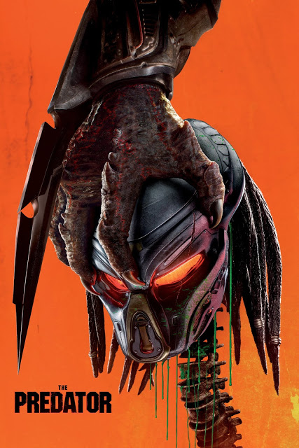

A few weeks ago I was on a 6-hour plane flight, followed immediately by a 15-hour flight. Just now I was again on a plane, first on a 2-hour flight, then a 12-hour flight, then another 2-hour flight. I probably spent the majority of the time staring into nothingness as I listened to the entire discography of Twenty One Pilots 3 times, but I managed to fit in a few movies into the 37 HOURS that I spent on a plane (holy crap). By the way, in case you were wondering, here’s an infographic of how to use a life vest that I took a picture of:

Anyways, here are some thoughts that I had while I watched them. Keep in mind, I was probably half asleep when watching half of these, so there really isn’t too much attention to detail here. I’m gonna start with the movies that I remember pretty clearly, and then work my way down to a short, probably meaningless review.

### Pirates of the Caribbean: At World’s End (2007)

Director: Gore Verbinski\
Genre: Action, Adventure\
Cast: Johnny Depp, Geoffrey Rush\
Rotten Tomatoes Score: 44

My Score: 9

Gotta be honest, there is heavy bias here because I’ve loved Pirates of the Caribbean ever since I watched the first movie (The Curse of the Black Pearl) many years ago. In fact, my favorite trilogy is probably the first three movies of Pirates of the Caribbean. If I were to review The Curse of the Black Pearl it would definitely get a 10.

What do I love about this movie?

I LOVE the characters. Jack Sparrow, Elizabeth Swann, Hector Barbossa, Will Turner, even all of the crew members have each built up their own personalities, and it’s amazing. I think the main reason why there is so much character development is because there are almost no new characters introduced in At World’s End (I count only one that played a significant role, the Singaporean pirate captain); everybody else has appeared in the previous two movies. This is partly due to the fact that they filmed the second and third movies one right after the other, which I think was an extremely clever move.

Not only do each of the characters get so much screen time that they build up strong personalities, they’re all different! We have the outrageously confusing Jack Sparrow, the outspoken Barbossa, the logical Will Turner, and the courageous Elizabeth Swann (her transformation across the trilogy was well supported and enjoyable to see).

Another thing I liked: this movie is not afraid of being realistic. Of course, this is a kid’s movie, so there are points that are unrealistic (such as the scene where Elizabeth and Will marry while fighting, but I was so caught up in the emotions and actions that I was honestly just rooting for them and enjoying the moment). But for the most part, the movie doesn’t shy away from bad things. For example, death is extremely present throughout this movie, with many of the characters that we’re rooting for dying. Literally in the first 3 minutes, we see a 10-year old being hanged, showing us really how evil Beckett is. For example, Elizabeth Swann’s dad, as well as her old fiancé (I forgot his name), all die, and their deaths all serve a purpose. Compared to movies now, which all seem to shy away from killing any characters that the audience knows, and only kills off extras as a way to show that the enemy actually poses some danger (there’s a lot of examples, but I’m thinking Ant Man right now), watching this movie was refreshing. On a similar note, I really liked the ending; it was happy, but it wasn’t too happy. The enemy was defeated, but there is still the bittersweet reality of Will’s fate. Also, Jack and Barbossa end up in very similar situations as when the series first started (with Jack commandeering a tiny boat, and Barbossa leading the Black Pearl but still outsmarted by Jack), which I loved. It really goes to show that despite everything, they are and will continue to be their same silly selves.

Also, the music. Simply put, hands-down my favorite score of all time. Enough said.

The only issue that I had issue with in this movie was that literally everybody has their own agenda, which often leads to a lot of backstabbing. With so many parties involved, it was at times hard to keep track of exactly who was trying to achieve what. But this was a small issue, and by the end, when everybody’s plans aligned, it seemed very clear.

Most importantly, this movie is funny and epic at the same time. I loved all the tiny jokes scattered throughout the movie, and the fight scenes were all so full of action. Even though this movie is almost 3 hours, it really doesn’t feel like that. Honestly, when it ended, it made me want to watch the entire PotC trilogy again. Unfortunately the plane didn’t have them…

### Pacific Rim: Uprising (2018)

Director: Steven S. DeKnight\
Genre: Action\
Cast: John Boyega, Cailee Spaeny\
Rotten Tomatoes Score: 44

My Score: 5

I actually really enjoyed the first Pacific Rim movie. Of course, there were so many plot holes in that movie, but the movie knew exactly what it was, and it executed beautiful. I came in expecting robots fighting aliens, and that’s exactly what I got.

_Pacific Rim: Uprising_ was also pretty fun to watch, but not nearly as much. I’m not sure exactly how to pinpoint it, but there is a point where things just become too ridiculous for me to not question. A lot of people had issue with the scientist played by Charlie Day becoming the antagonist by being mind-controlled, but strangely, I wasn’t too bothered by it. Instead, here is a list of things that I simply could not overlook (ignoring the insane speed at which Jaegars are repaired, since the original movie also had this issue:

- How is such a large program such as the Jaegar program so freaking poor and understaffed. Seriously, they literally have NO backup pilots and require on their cadets to save the world? It seems as if the cadet program seems like a very prestigious thing that many apply for (hence the anger that some cadets expressed when the little girl was able to join without a formal application), so shouldn’t there be some other trained pilots?
- Why are the cadets so good, but the actual fully trained pilots so bad at fighting monsters? They literally die without putting up a proper fight.
- How in the world did Charlie Day manage to sneak in so much alien technology? He is only one scientist, and probably never even built any of the drones himself.
- Speaking of which, how was the black Jaegar controlled by the Kaiju brain even built?
- When the Jaegars are fighting the Kaijus, Charlie Day is literally just commentating the match on top of the roof, saying things like “You like that? Are you ready for this surprise?”, which seems like an extremely random thing to do.
- What was the reason for killing off the Indian boy, but keeping the German boy alive? I literally see no point in this, either leave them both alive or kill them both. I get that you want to show that Kaijus are actually dangerous (duh) but you gotta go all-in, movie-maker.
- What are the chances of Gypsy Avenger hitting the Kaiju on its descent? Probably negligibly low. They had basically no chance to aim, and the fact that the fuel source was literally welded to the Jaegar’s hand makes the chances even lower.

Even action-wise, I also thought that Uprising was lacking compared to the original Pacific Rim. The main reason is because of the final scene. In Pacific Rim the final blow was epic, with a sword and everything, but in Uprising the final thing the humans do is literally just launch an empty Jaegar at the Kaiju. It may make sense, but come one, I wanted something that looked cooler (at least have the Jaegar be in a cool pose or with a cool weapon or something).

Don’t get me wrong, I still had fun watching robots beating up monsters. But in almost every measure, I preferred the original movie over this (maybe the only thing that was executed better in Uprising was slightly more character development for the main character), which is why I think it only deserves a 5.

### The Predator (2018)

Director: Shane Black\
Genre: Action\
Cast: Boyd Holbrook, Trevante Rhodes\
Rotten Tomatoes Score: 32

My Score: 2

I didn’t even come close to finishing this movie. I stopped after like 20 minutes (at the scene where the Predator wakes up and starts killing scientists) because it was just too awful for me to continue. 2 main things that prevented me from continuing to enjoy this movie.

First, cliches and stupid plot holes everywhere. The biggest ones I noticed right off the bat:

- The professor gets randomly captured from her university for a government thing.
- They drug the Predator but don’t even restrain it??? Wtf of course it’s going to kill everybody when it wakes up (which we all knew would happen, because cliches).
- I’m not sure what the kid has, but he seems to have a very high intelligence level but ultra-sensitivity to noises, etc. There are SO many ways to creatively introduce his special situation, but the movie opts for bullies pulling a fire alarm and bullying him (and it’s not even real bullying, they literally just look at him, laugh, and leave…). Also where is the teacher and how could the teacher literally just leave a student alone in his own classroom?

Second, I don’t like the main character. This is a major issue, because I’m supposed to be rooting for the soldier, but honestly, after the first 20 minutes, he literally just seems like a heartless dick. We’re told (and shown) that he has a wife and child at home that he hasn’t seen in a long time, but there is literally no indication that he even loves them (he doesn’t even mention them, it’s other people bringing it up to him). The first time we’re introduced to some people that the audience might like, the ragtag squad on the bus, the main character acts like a jackass to them and tells them to shut up. I literally can’t even recall the main character’s name, let alone find myself supporting him.

### Isle of Dogs (2018)

Director: Wes Anderson\
Genre: Animation, Adventure\
Cast: Bryan Cranston, Edward Norton\
Rotten Tomatoes Score: 89

My Score: 8

I’ve heard of Wes Anderson, and I’ve seen trailers for this movie before, so I decided to give this movie a go. I’m sorry to say that I cannot adequately describe why or how this movie is good, but it simply is. The entire story is absurd: a small boy travels to a trash island to find and save his dog, while a girl attempts to expose the government’s corruption. And yet despite the pure absurdity of this plot, Anderson somehow still pulls it off; I really didn’t have issue with anything major in this movie.

I think the main reason for this is because of the creativity that is present throughout the entire movie. The way how the story is told (mainly from the perspective of the dogs), the way that scenes are “shot”, the entire of the style of the movie was unique, and that’s what kept me glued to the screen. It was definitely a unique experience, and I would definitely recommend everybody to check out this movie (you won’t really know what I mean until you watch it). That being said, I definitely can’t rewatch this movie too many times; I can already feel that part of the experience is watching this entirely new style of cinema, and after a few rewatches it won’t be as meaningful.

### Fast & Furious (2009)

Director: Justin Lin\
Genre: Action\
Cast: Vin Diesel, Paul Walker\
Rotten Tomatoes Score: 29

My Score: 5

This movie was just like any action movie, and I enjoyed it. Honestly, I don’t remember anything special about it, but the driving was cool and I had a pretty good time watching so it deserves an okay rating in my book.

Date Reviewed: 01/19/2019
