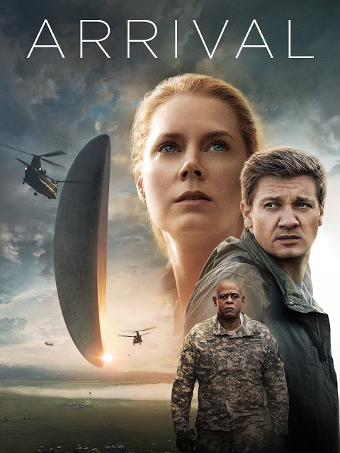

Arrival

Year Released: 2016\
Genre: Drama, Science Fiction\
Director: Denis Villeneuve\
Lead Actors/Actresses: Amy Adams, Jeremy Renner

Rotten Tomatoes Score: 94

My Score: 10

I first watched _Arrival_ at around 2017, and unfortunately, I had deeply underestimated it when I was loading it up. I was most likely really tired at that time, not ready to think. Based on the trailers, I had thought that the movie was just another alien film, full of action and war. A movie perfect for a lazy evening.

I was very mistaken. This movie turned out to be one of the most emotionally and intellectually intensive movies I had ever watched, and I just couldn't follow what was going on. After the movie was done, I had literally no clue what had happened, so I ended up ruining the experience for myself by looking it up on Wikipedia to find out what I had just watched. I never got to fully appreciate the film itself, all because I had watched it at the wrong time.

Earlier this week, I decided that it was finally time for me to revisit this movie and actually understand it. I knew beforehand what the big reveal was going to be, and I also knew that the movie was considered an amazing film, but what I watched over the last 3 days still far surpassed my expectations. I can honestly say that it's one of the best I've seen.

This is the first review I'm going to write where I don't want to spoil anything significant; watching the movie for the first time is probably the best thing about this movie, and if I could, I would definitely erase my memory so I could truly experience this movie as it was supposed to be experienced.

It's hard to write down explicitly why I liked this film so much, but I've narrowed it down to these few points:

I guess the most first thing everybody's going to say is the plot structure. And yes, much like _The Prestige_, this movie is written and directed amazingly well; watching it again for the second time, you can definitely see all the tiny hints that are scattered throughout. But for me, what really differentiates this movie is the other three points.

- Character development. This movie only has 2 characters, and 90% of the time is spent on the main character. We really get to know this person, and feel everything that she's feeling. And when the end nears and the truth hits, it really hits us as the viewers as well.
- Acting. Amy Adams does so well in this movie, and it pushes the character development even further. Her acting is just so real and relatable, it's hard to imagine that this character is completely fictional.
- Music composition. This is one of the only movies where there are entire segments that are completely devoid of any significant speech, filled only with the sound of the violin from "The Nature of Daylight," and it works so well. There are also so many repeated shots, but instead of feeling repetitive, these repeated scenes hit me even harder than before, partly because of the music as well.

In the end, the way I would describe this movie is that it doesn't entertain me. It instead makes me feel. It makes me think. I strongly encourage those who haven't seen this film to go see it. But please be emotionally and intellectually prepared when you do.

Date Reviewed: 8/13/2019
