These past few weeks have been pretty crazy. All my classes have moved remote, and everything is now being graded PNP for me. I've found that I have so much more time nowadays, and a lot of it has gone to watching random movies. Here are my very quick reviews of the ones I got through so far. These are not fully formulated opinions by any means, just mainly as a way for me to remember how I felt about them.

### A Silent Voice (2016)

Director: Naoko Yamada\
Genre: Drama, Romance\
Cast: Miyu Irino, Saori Hayami\
Rotten Tomatoes Score: 94

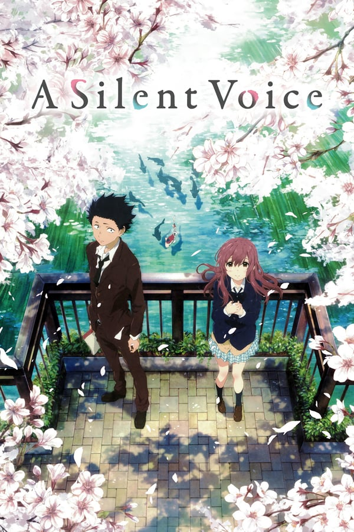

My Score: 7

This movie was great! I liked how it focused a lot more about the characters' struggles, diving deeper into existential issues, rather than just focusing on the romance portion. Indeed, I didn't feel that the romance was forced at all, and in the end the most important point was that Shoya finally found his group of friends, and a purpose. Only reason that I gave this score as opposed to a higher one was because like many other anime films, I felt that there was a slight dramatization, especially during the "conflict" when everybody got into an argument. There were a few characters that I thought could be developed more, too, or maybe they could have been removed altogether (for example, the orange-haired guy).

### Tropic Thunder (2008)

Director: Ben Stiller\
Genre: Comedy, Action\
Cast: Ben Stiller, Robert Downey, Jr.\
Rotten Tomatoes Score: 81

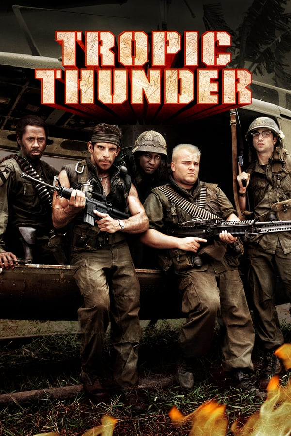

My Score: 8

This movie is one of the best comedy movies out there, it really is unlike anything else. To be honest, there's nothing too deep that I can talk about here, other than that it's very funny. Much like Borat, I think this is a great movie that everybody should watch! It never gets old, and its great for whenever friends are over and you want to have a laugh.

### 21 (2008)

Director: Robert Luketic\
Genre: Drama, Crime\
Cast: Jim Sturgess, Kevin Spacey\
Rotten Tomatoes Score: 36

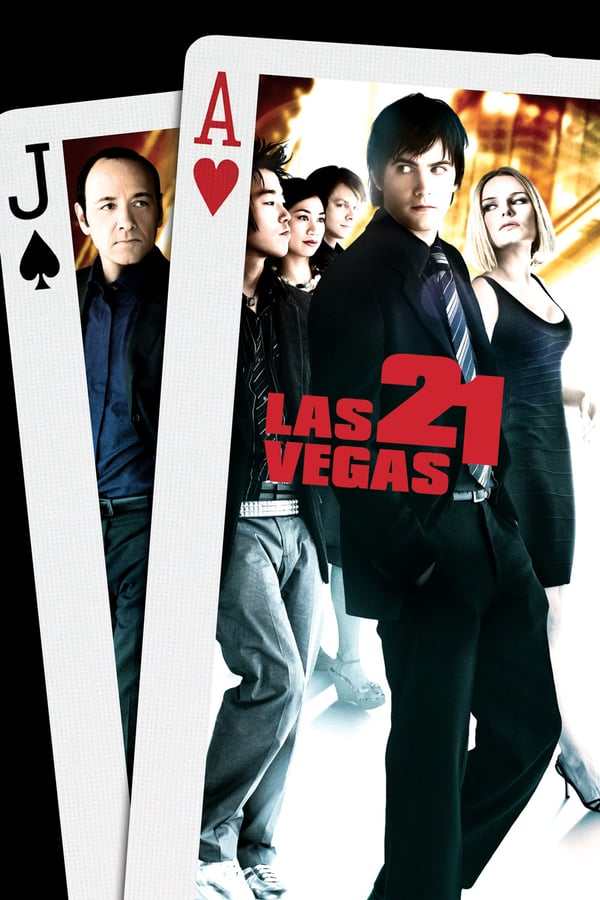

My Score: 3

I felt like this movie had such a cookie-cutter plot, I could foresee pretty much everything, and at best everything was executed at a mediocre level. The ending was not really satisfying, because I personally didn't think that the main character experienced that much growth. But in the end, the biggest thing was that everything was just so predictable.

### Hot Fuzz (2007)

Director: Edgar Wright\
Genre: Comedy, Action\
Cast: Simon Pegg, Nick Frost\
Rotten Tomatoes Score: 91

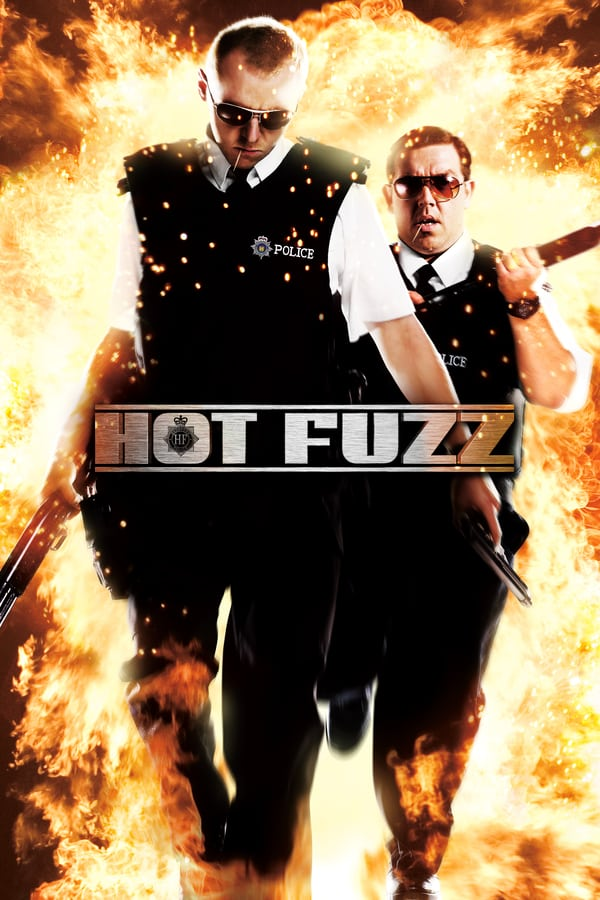
 
My Score: 8

I first became interested in watching Edgar Wright when I discovered this [video](https://www.youtube.com/watch?v=3FOzD4Sfgag) by Every Frame a Painting, which discussed the unconventional, smart way that Wright directs comedy. And I can clearly see what Tony meant when watching this movie. There is a ton of visual comedy scattered throughout the film, and the plot is amazing. Personally, out of the Three Flavours Cornetto trilogy, this is by far my favorite, mainly because it isn't too bizarre, but still ridiculous enough for us to rally behind the main character and enjoy what's happening. I think there are very few comedy movies that are re-watchable, but Hot Fuzz is definitely one. That being said, I think that one slight flaw that this movie has for me in particular is that I don't feel especially invested in the characters. Rather, I'm just there to enjoy the story (and that's completely fine!, but that's the only thing keeping this at an 8 as opposed to a 9 or 10).

### Blade Runner (1982)

Director: Ridley Scott\
Genre: Sci-Fi, Thriller\
Cast: Harrison Ford, Sean Young\
Rotten Tomatoes Score: 90

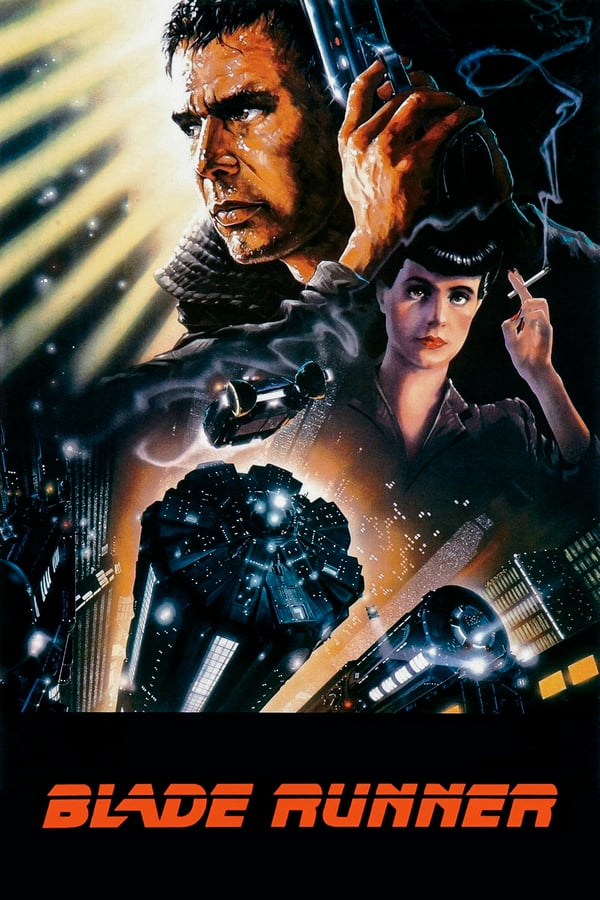

My Score: 6

Definitely need to rewatch this. I think there is a lot more analysis that should be done. I'm rating this at a 6 so far because I was so confused at the end of the film, and honestly didn't even expect that the film had ended. After thinking about this film more, I started to appreciate the style and direction of this film, but definitely needs a revisit.

### Don Jon (2013)

Director: Joseph Gordon-Levitt\
Genre: Romance, Drama\
Cast: Joseph Gordon-Levitt, Scarlett Johansson\
Rotten Tomatoes Score: 79

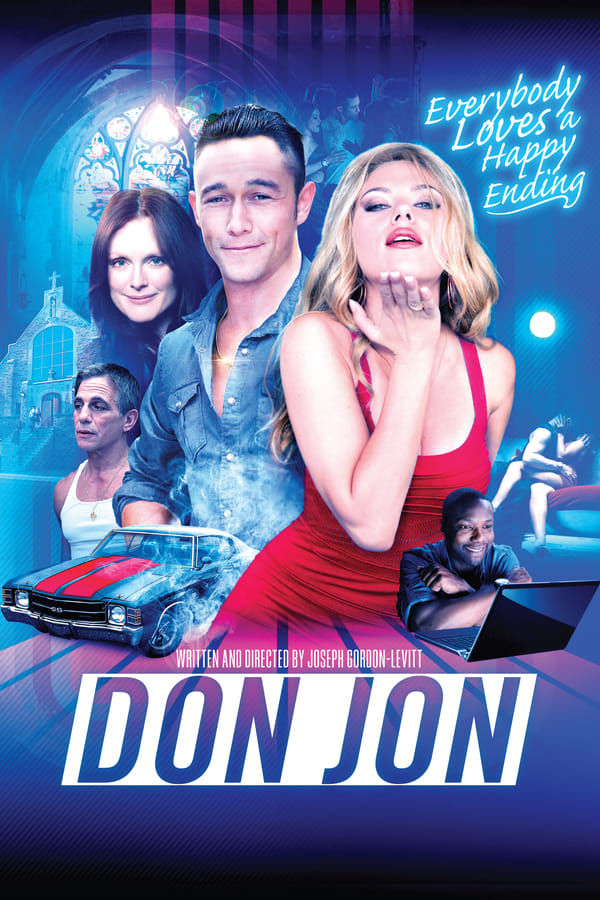

My Score: 7

This movie was really fun, I decided to watch it one day and completely finished it in one sitting without even realizing that time had passed. Overall, I think that Joseph Gordon-Levitt was able convey his message in an entertaining package, one that broke the conventional romance film standards, which made it much more interesting!

### Fantastic Beasts: The Crimes of Grindelwald (2018)

Director: David Yates\
Genre: Fantasy, Adventure\
Cast: Eddie Redmayne, Johnny Depp\
Rotten Tomatoes Score: 36

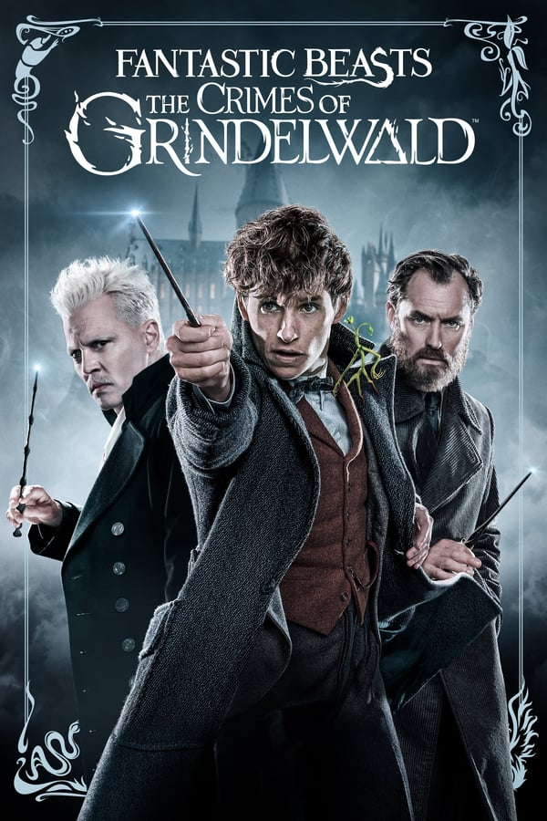

My Score: 5

The plot of this film is way too confusing, with a ton of build up and very payoff. Traditionally, directors typically choose to introduce this much set up in a film towards the end of a series (such as Harry Potter, Avengers, etc.), but this is only the second film! In addition, I feel like in other series, there is always still a lot of plot development, but for some reason when I look back I felt like there was very little action in this movie. In addition, some of the plot points were simply not convincing; in particular, I really don't understand why Goldie changed sides, and the reasons that the movie offered made absolutely no sense. I also didn't really care for Lestrange at all, so when she died I felt pretty much nothing. Nevertheless, I will continue to watch these movies until the end of the series, mainly because I absolutely love Newt and Tina as characters, and I want to continue to follow them.

### The Theory of Everything (2014)

Director: James Marsh\
Genre: Drama, Romance\
Cast: Eddie Redmayne, Felicity Jones\
Rotten Tomatoes Score: 79

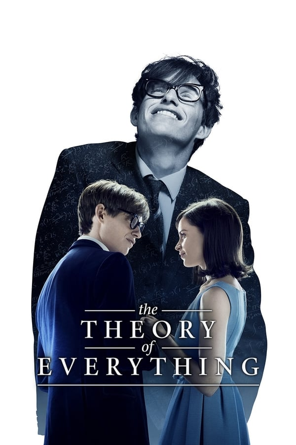

My Score: 5

Eh, just an overall good biographical movie, but nothing really stood out.

### Scott Pilgrim vs. The World (2010)

Director: Edgar Wright\
Genre: Action, Romance\
Cast: Michael Cera, Mary Elizabeth Winstead\
Rotten Tomatoes Score: 81

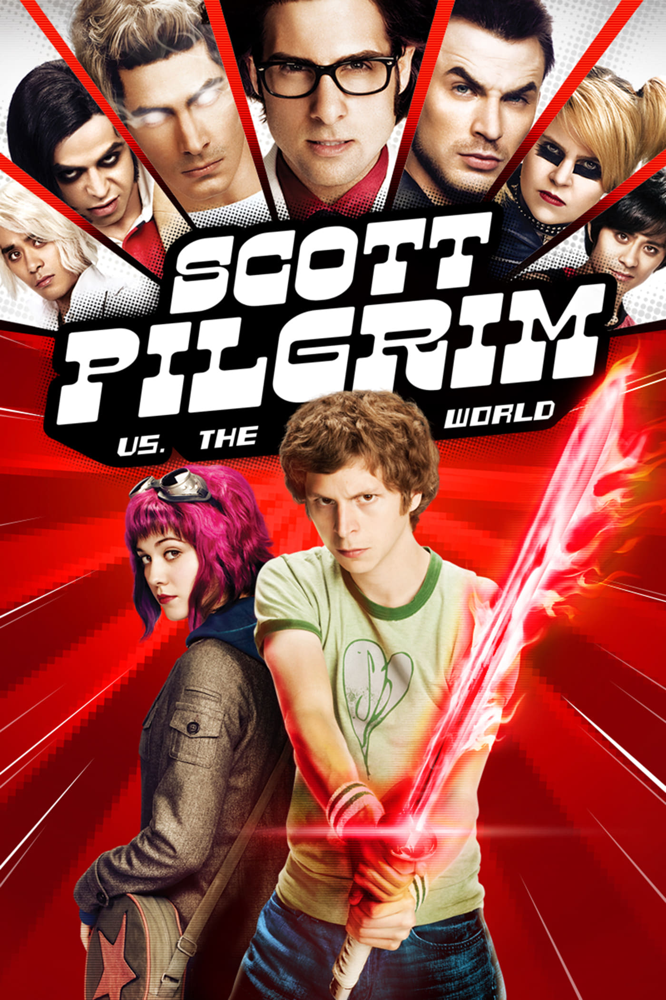

My Score: 9

I really really liked this film. This movie is an adaptation of a comic book, and it does so in such a clever way. I discovered this movie after watching Spider-Man: Into the Spider-Verse and even though its an animation, I think these films used a lot of similar techniques in terms of cinematography. In addition to the style, the comedy is amazing. This is one of very few movies that actually made me actually pause and laugh out loud. The acting, the characters, the pacing, was just perfect. The only reason why this wasn't a 10 for me was that I definitely thought that the alternate ending, with Scott and Knives, was better :(.

### The World's End (2013)

Director: Edgar Wright\
Genre: Comedy, Action\
Cast: Simon Pegg, Nick Frost\
Rotten Tomatoes Score: 89

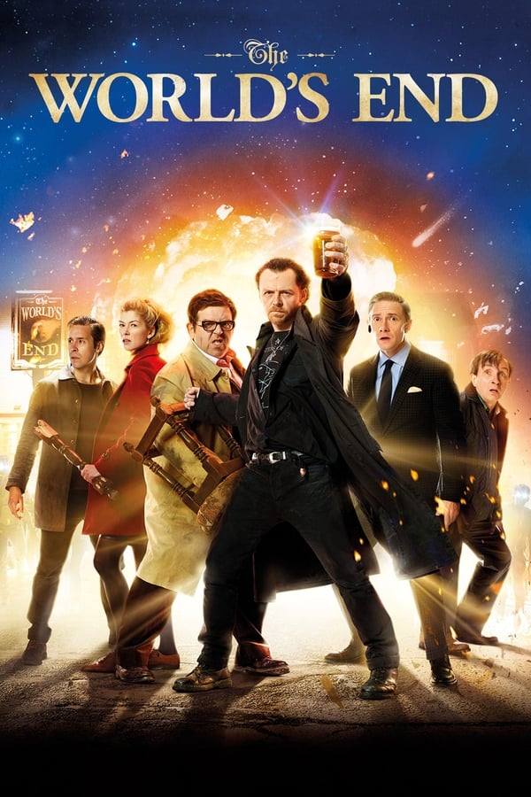

My Score: 7

When I first watched this movie, the sudden plot-twist came at a complete surprise and because of that, I thoroughly enjoyed it. I heavily recommend others to not watch the trailer before watching this movie, because it really made the experience much more fun! Overall, the shock factor really works well as this films descends into absolute absurdity, but at the same time there are a ton of layers and character depth. Nevertheless, since this movie is part of the Three Flavours Cornetto trilogy, I can't help but compare it to Hot Fuzz, and in the end I did think this film does fall slightly short in comparison. Both movies have a ton of "smart visual" comedy, but Hot Fuzz just had a tiny bit more which I enjoyed.

### Knives Out (2019)

Director: Rian Johnson\
Genre: Mystery, Drama\
Cast: Ana de Armas, Daniel Craig\
Rotten Tomatoes Score: 97

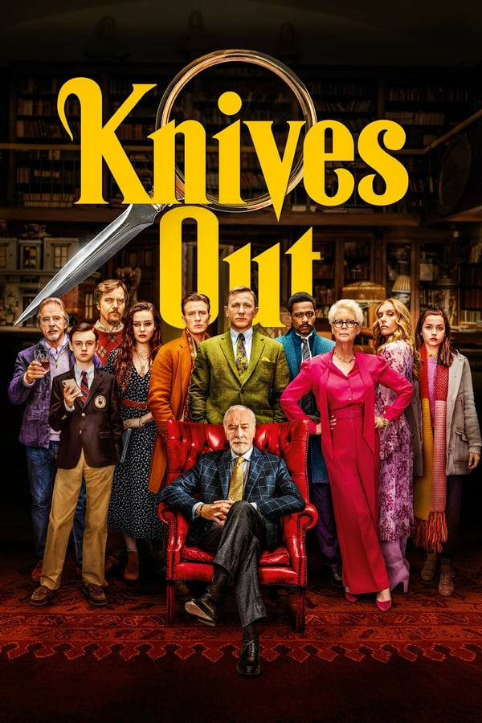

My Score: 7

Really entertaining, I enjoyed it a lot! Also, I like how the story didn't focus around Daniel Craig's character, and even though he is the smart one, he doesn't come off as arrogant, and he never really is the star of the show. Only bad thing was that I kinda already suspected the final reveal, because he just seemed way too unlike the rest of the characters, so he had to have done something.

### 10 Cloverfield Lane (2016)

Director: Dan Trachtenberg\
Genre: Thriller, Drama\
Cast: Mary Elizabeth Winstead, John Goodman\
Rotten Tomatoes Score: 90

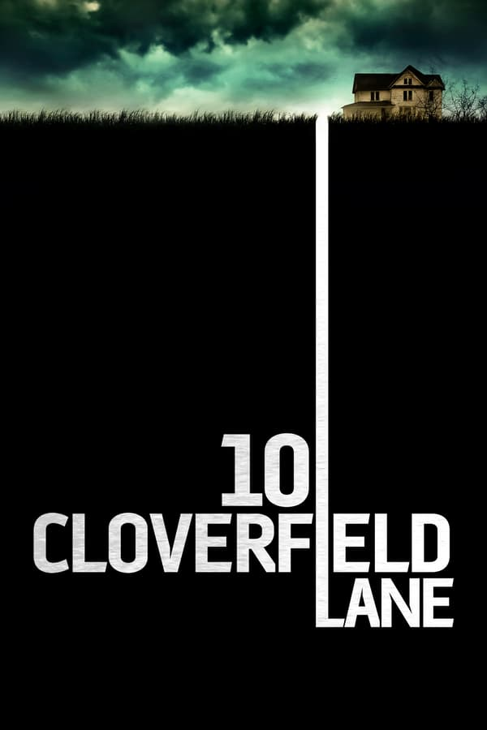

My Score: 8

Before watching this movie, I did not know of the Cloverfield world. Overall, the first 90% of the movie is done so well. I was on the edge of my seat the entire time, and John Goodman has such an amazing performance that strikes intense fear. In addition, I really like how they shaped Mary Elizabeth Winstead's character, as a smart and calculating lead, somebody that everybody watching is rooting for. The movie starts falling a bit apart when it randomly introduces aliens. To be honest, I can't really pinpoint the best possible way to end what was otherwise a 10/10 movie, but I do think that the overall direction in the end was wrong. In particular, after reading more about the Cloverfield franchise, I wish that the movie had been not titled "10 Cloverfield Lane". I felt like that might have ruined the movie for many people, who were already expecting aliens. Instead, just keeping the shot of the fallen mailbox at the end would have been a perfect easter egg. After all, one of the reasons why this movie worked so well was because of the suspense behind what had actually happened in the outside world.

Date Reviewed: 04/20/2020
